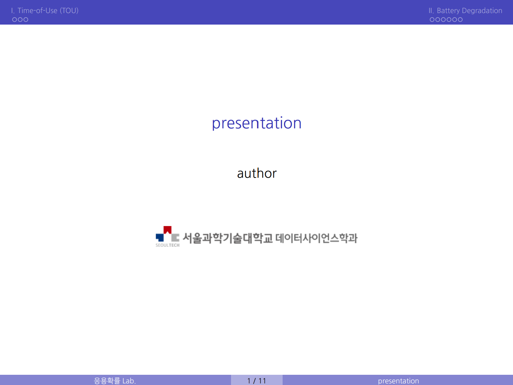
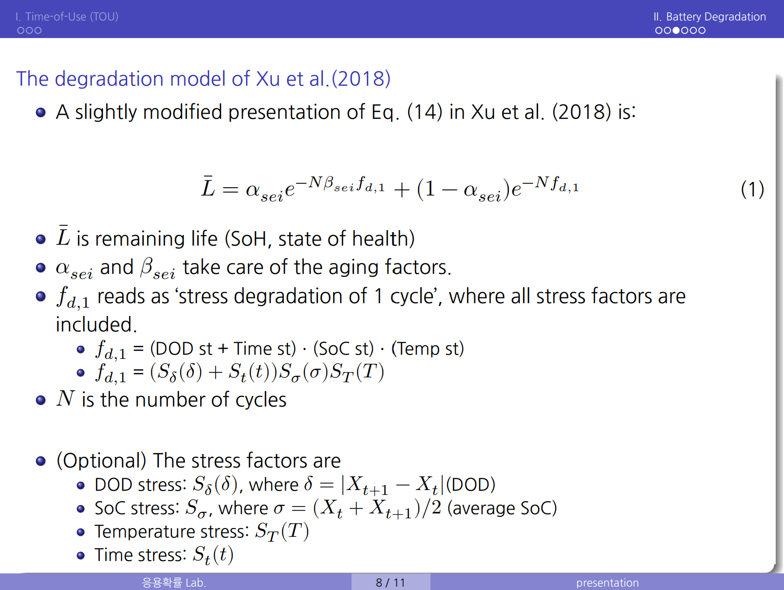
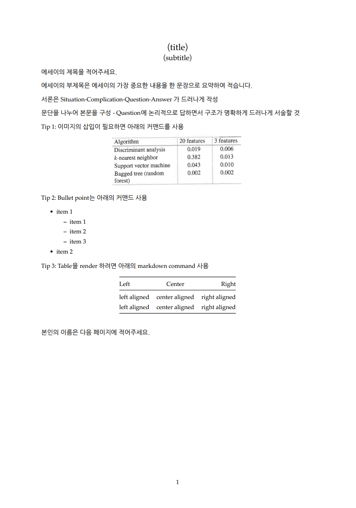
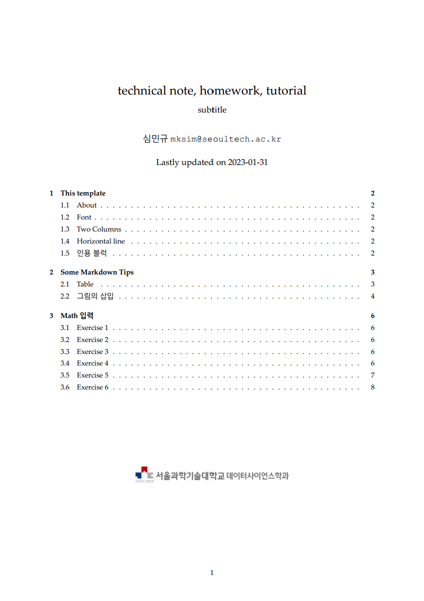
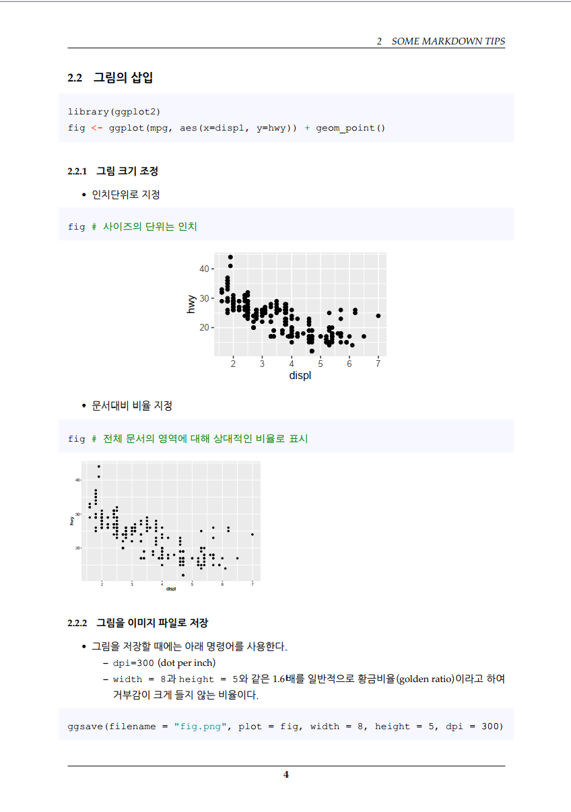
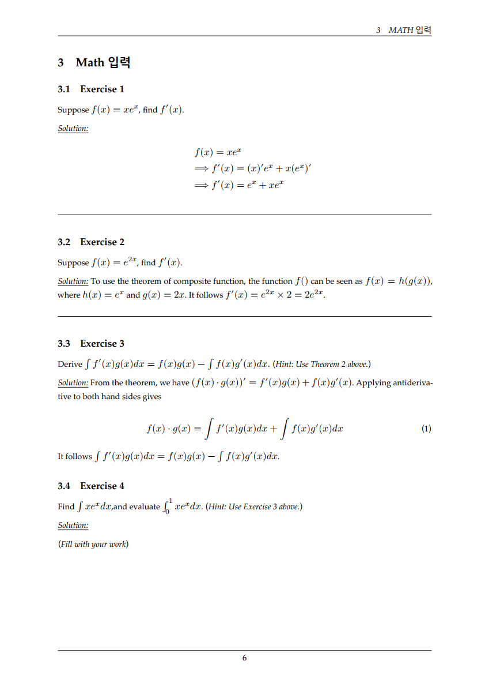
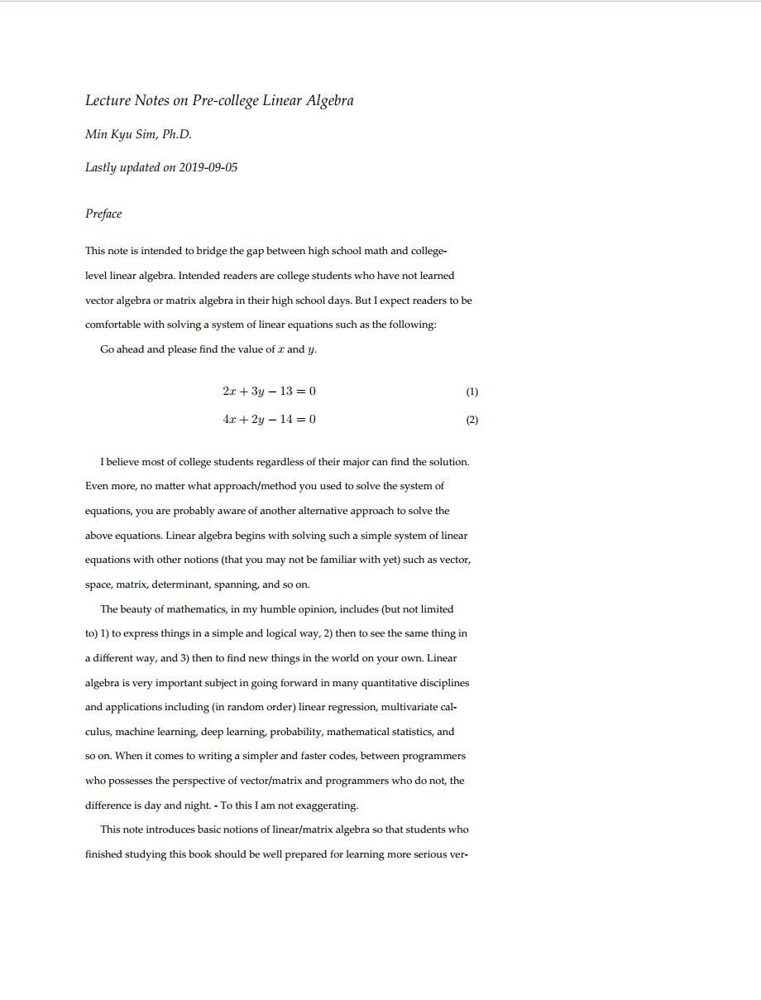
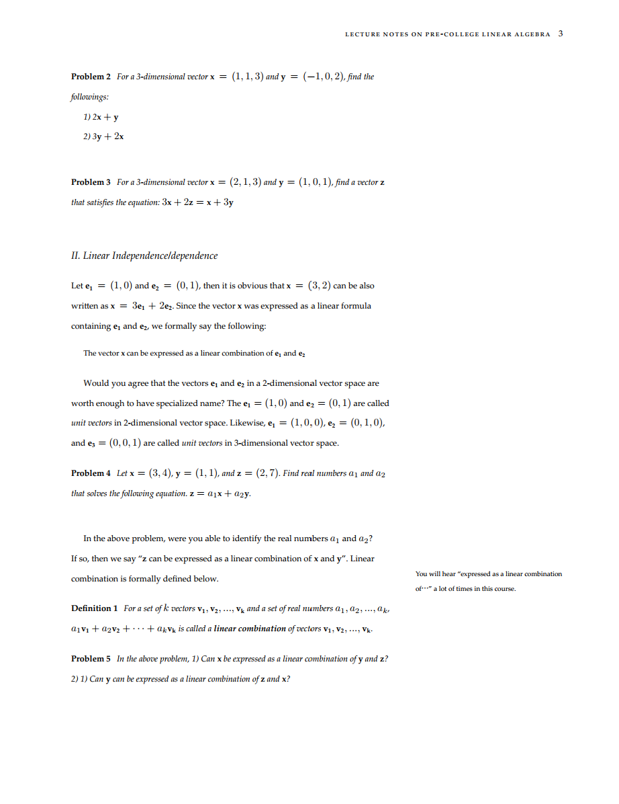

## R Markdown의 포맷 템플릿을 모아둔 곳

+ **설치등의 complete한 메뉴얼은 `1_r_python_latex.pdf`임.**
+ 주로 한글 사용을 활성화 하는 셋팅을 했음
+ docx의 경우에는 폰트의 조정등을 했음

### 1. beamer

### 2. pdf - essay

### 3. pdf - technical note

### 4. tufte

